# Litestar Architecture Diagrams (Detailed & Descriptive)

## 1. High-Level Architecture Overview with Detailed Descriptions

```mermaid
flowchart TB
    subgraph AppLayer["🎯 Application Layer - User-Facing Components"]
        App["Litestar App<br/>────────────<br/>• Main entry point for your application<br/>• Manages configuration & lifecycle<br/>• Registers routes, middleware, plugins<br/>• Similar to Flask() or FastAPI()"]
        
        Router["Router<br/>────────────<br/>• Groups related endpoints together<br/>• Defines URL path prefixes<br/>• Can have own middleware/guards<br/>• Think: /api/v1/* routes"]
        
        Controller["Controller<br/>────────────<br/>• Class-based route organization<br/>• Groups related business logic<br/>• Shared dependencies & guards<br/>• Like Django ViewSets"]
    end
    
    subgraph ASGILayer["⚡ ASGI Layer - Protocol Implementation"]
        ASGIRouter["ASGI Router<br/>────────────<br/>• Converts HTTP to ASGI events<br/>• Main request dispatcher<br/>• Handles async communication<br/>• Core of async performance"]
        
        RoutingTrie["Routing Trie<br/>────────────<br/>• Tree structure for URL matching<br/>• O(n) path lookup complexity<br/>• Handles path parameters<br/>• /users/{id}/posts/{pid}"]
        
        ASGIApp["ASGI Applications<br/>────────────<br/>• Standard Python async apps<br/>• Handle scope, receive, send<br/>• WebSocket & HTTP support<br/>• Interoperable with other frameworks"]
    end
    
    subgraph HandlerLayer["📝 Handler Layer - Request Processing"]
        HTTPHandler["HTTP Handlers<br/>────────────<br/>• @get, @post, @put, @delete<br/>• Handle REST API requests<br/>• Return JSON, HTML, files<br/>• Sync or async functions"]
        
        WSHandler["WebSocket Handlers<br/>────────────<br/>• Real-time bidirectional comm<br/>• @websocket decorator<br/>• Streaming & pub/sub support<br/>• Chat, notifications, live data"]
        
        ASGIHandler["ASGI Handlers<br/>────────────<br/>• Raw ASGI interface access<br/>• Maximum control & flexibility<br/>• Custom protocols<br/>• Advanced use cases"]
    end
    
    subgraph MiddlewareLayer["🛡️ Middleware Layer - Request/Response Pipeline"]
        AuthMiddleware["Authentication<br/>────────────<br/>• JWT, Session, OAuth<br/>• User identification<br/>• Token validation<br/>• Sets request.user"]
        
        CORSMiddleware["CORS<br/>────────────<br/>• Cross-Origin Resource Sharing<br/>• Browser security policy<br/>• Allows frontend API calls<br/>• Configurable origins"]
        
        CompressionMiddleware["Compression<br/>────────────<br/>• Gzip, Brotli compression<br/>• Reduces bandwidth usage<br/>• Automatic for responses<br/>• 60-80% size reduction"]
        
        CSRFMiddleware["CSRF Protection<br/>────────────<br/>• Prevents forged requests<br/>• Token-based validation<br/>• Form & API protection<br/>• Security best practice"]
        
        RateLimitMiddleware["Rate Limiting<br/>────────────<br/>• Request throttling<br/>• DDoS protection<br/>• Per-user/IP limits<br/>• Redis/memory backed"]
    end
    
    subgraph DataLayer["📦 Data Layer - Serialization & Validation"]
        DTO["DTOs - Data Transfer Objects<br/>────────────<br/>• Define API contracts<br/>• Field inclusion/exclusion<br/>• Rename & transform fields<br/>• Security by design"]
        
        Serialization["Serialization Engine<br/>────────────<br/>• JSON/MessagePack conversion<br/>• 10-50x faster with msgspec<br/>• Type-safe transformations<br/>• Handles nested objects"]
        
        Validation["Validation System<br/>────────────<br/>• Type checking at runtime<br/>• Constraint validation<br/>• Custom validators<br/>• Detailed error messages"]
    end
    
    subgraph PluginSystem["🔌 Plugin System - Extensibility"]
        InitPlugin["Init Plugins<br/>────────────<br/>• Modify app at startup<br/>• Add global config<br/>• Register components<br/>• Database connections"]
        
        SerializationPlugin["Serialization Plugins<br/>────────────<br/>• Custom type support<br/>• Pydantic, attrs integration<br/>• Custom encoders/decoders<br/>• Domain objects"]
        
        OpenAPIPlugin["OpenAPI Plugins<br/>────────────<br/>• API documentation<br/>• Swagger/ReDoc UI<br/>• Schema customization<br/>• Client code generation"]
        
        CLIPlugin["CLI Plugins<br/>────────────<br/>• Custom commands<br/>• Management tasks<br/>• Database migrations<br/>• Development tools"]
    end
    
    subgraph SupportingSystems["🔧 Supporting Systems - Core Services"]
        DI["Dependency Injection<br/>────────────<br/>• Automatic wiring<br/>• Request/app scoped<br/>• Testing friendly<br/>• Clean architecture"]
        
        Events["Event System<br/>────────────<br/>• Lifecycle hooks<br/>• Before/after request<br/>• Custom events<br/>• Decoupled logic"]
        
        Stores["Storage System<br/>────────────<br/>• Session management<br/>• Cache storage<br/>• File uploads<br/>• State persistence"]
        
        Templates["Template Engine<br/>────────────<br/>• Jinja2 integration<br/>• HTML rendering<br/>• Email templates<br/>• Server-side rendering"]
        
        Channels["Channels/PubSub<br/>────────────<br/>• Message broadcasting<br/>• WebSocket rooms<br/>• Event distribution<br/>• Real-time updates"]
    end
    
    App --> Router
    Router --> Controller
    Controller --> HTTPHandler
    Controller --> WSHandler
    
    App --> ASGIRouter
    ASGIRouter --> RoutingTrie
    ASGIRouter --> ASGIApp
    
    ASGIApp --> AuthMiddleware
    AuthMiddleware --> CORSMiddleware
    CORSMiddleware --> HTTPHandler
    
    HTTPHandler --> DTO
    DTO --> Serialization
    
    App --> InitPlugin
    App --> DI
    
    DI --> HTTPHandler
    Events --> App
```

## 2. Request Response Flow

## 3. Core Module Structure

## 4. Routing Trie Data Structure

## 5. Dependency Injection System

## 6. Plugin Architecture

## 7. Middleware Stack Execution

## 8. DTO and Serialization Layer

## 9. Event System State Machine

## 10. Simplified Complete Architecture - Beginner Friendly

```mermaid
flowchart TB
    Client["Client - Browser/Mobile/API<br/>────────────<br/>• Makes HTTP/WebSocket requests<br/>• Sends JSON/Form data<br/>• Receives responses"]
    
    subgraph Litestar["🚀 Litestar Application"]
        App["App Core<br/>────────────<br/>• The main Litestar() instance<br/>• Configures entire application<br/>• Entry point for all requests"]
        
        subgraph Routing["🗺️ Routing - URL to Code Mapping"]
            Router["Router<br/>────────────<br/>• Maps URLs to functions<br/>• /users → get_users()<br/>• Pattern matching"]
            Trie["Routing Trie<br/>────────────<br/>• Fast URL lookup tree<br/>• Handles /users/{id}<br/>• Extracts parameters"]
        end
        
        subgraph Handlers["👨‍💻 Handlers - Your Business Logic"]
            HTTP["HTTP Handler<br/>────────────<br/>• Your API functions<br/>• @get, @post decorators<br/>• Return JSON/HTML"]
            WS["WebSocket Handler<br/>────────────<br/>• Real-time connections<br/>• Chat, notifications<br/>• Two-way communication"]
            ASGI["ASGI Handler<br/>────────────<br/>• Advanced usage<br/>• Custom protocols<br/>• Full control"]
        end
        
        subgraph Middleware["🛡️ Middleware - Request Filters"]
            CORS["CORS<br/>────────────<br/>• Allow browser requests<br/>• Cross-origin control<br/>• Frontend compatibility"]
            Auth["Auth<br/>────────────<br/>• User authentication<br/>• JWT/Session tokens<br/>• Access control"]
            Cache["Cache<br/>────────────<br/>• Store responses<br/>• Improve performance<br/>• Reduce DB hits"]
        end
        
        subgraph Data["📊 Data Layer - Input/Output"]
            DTO["DTO<br/>────────────<br/>• API contracts<br/>• Hide sensitive fields<br/>• Transform data shape"]
            Validation["Validation<br/>────────────<br/>• Check input data<br/>• Type verification<br/>• Business rules"]
            Serialization["Serialization<br/>────────────<br/>• Python ↔ JSON<br/>• Fast conversion<br/>• Nested objects"]
        end
        
        subgraph DI["💉 DI System - Smart Wiring"]
            Container["DI Container<br/>────────────<br/>• Manages dependencies<br/>• Auto-injection<br/>• Database, services"]
            Scopes["Scopes<br/>────────────<br/>• Request: per-request<br/>• App: singleton<br/>• Lifecycle management"]
        end
        
        subgraph Plugins["🔧 Plugins - Extensions"]
            PydanticP["Pydantic<br/>────────────<br/>• Data validation<br/>• Popular schemas<br/>• Type safety"]
            SQLAP["SQLAlchemy<br/>────────────<br/>• Database ORM<br/>• SQL queries<br/>• Migrations"]
            OpenAPISpec["OpenAPI<br/>────────────<br/>• Auto documentation<br/>• Swagger UI<br/>• API testing"]
        end
    end
    
    Client -->|"1. HTTP Request"| App
    App -->|"2. Find route"| Router
    Router -->|"3. Match pattern"| Trie
    Trie -->|"4. Apply filters"| Middleware
    Middleware -->|"5. Call handler"| HTTP
    Middleware -->|"5. Or WebSocket"| WS
    HTTP -->|"6. Get dependencies"| Container
    Container -->|"7. Inject services"| Scopes
    HTTP -->|"8. Process data"| DTO
    DTO -->|"9. Validate input"| Validation
    Validation -->|"10. Convert to JSON"| Serialization
    App -->|"Uses"| PydanticP
    App -->|"Uses"| SQLAP
    App -->|"Uses"| OpenAPISpec
    
    style Client fill:#e1f5fe
    style App fill:#90ee90
    style HTTP fill:#ffffcc
    style DTO fill:#ffcccc
```

